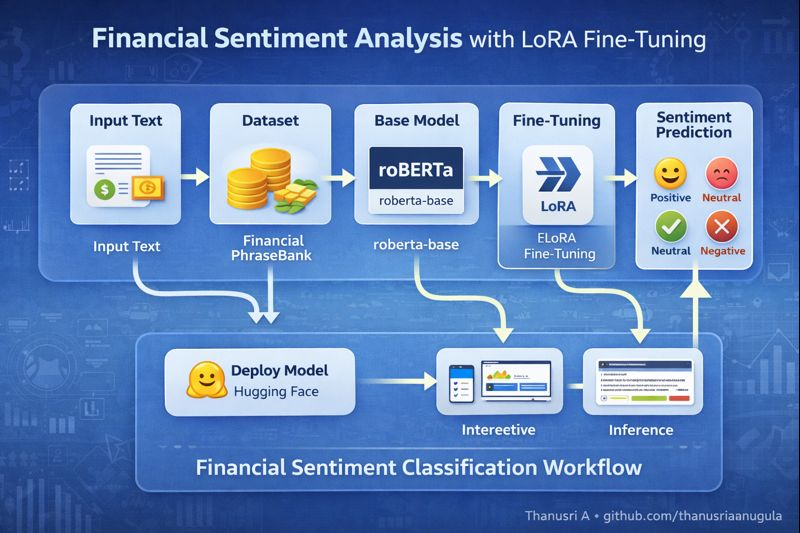
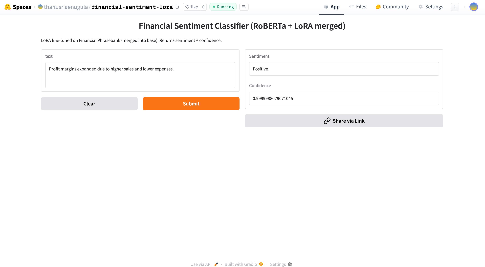
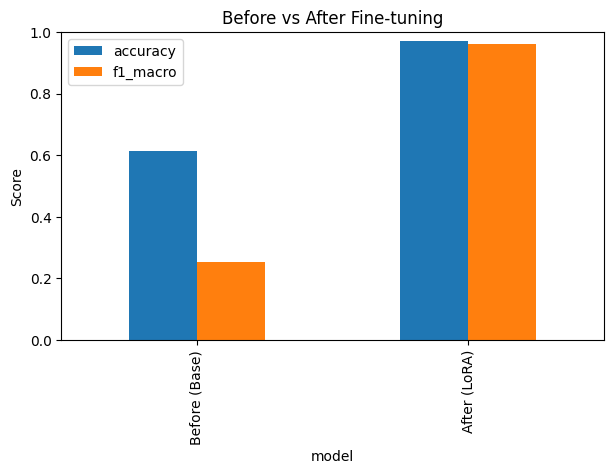

# LLM-Adaptation-for-Financial-Text-Classification with LoRA Fine-Tuning (RoBERTa)

This project demonstrates **parameter-efficient fine-tuning** of a **RoBERTa** model using **LoRA (Low-Rank Adaptation)** for **financial sentiment classification**.  
The model is trained on the **Financial PhraseBank** dataset to classify text into:

- **Positive**
- **Neutral**
- **Negative**

---

# Project Overview

Traditional fine-tuning of large language models is computationally expensive.  
This project uses **LoRA (PEFT)** to fine-tune only a small subset of parameters, making training:

- Faster  
- Memory-efficient  
- Cost-effective  

We fine-tune **RoBERTa** for a **3-class sentiment classification** task in the financial domain.

---

## Workflow Graph

  

---

## Hugging Face Deployment Screenshot

### Let us try to check the performance of fine tuned model for a positive sentiment with confidence 

   
  

### Let us try to check the performance of fine tuned model for a neutral sentiment with confidence

  
  

### Comparison of performance of the model before and after fine tuning

  
  

## Dataset

**Source:**  
`FinanceMTEB/financial_phrasebank` (Hugging Face)

---

## Model

- Base Model: `roberta-base`
- Task: Sequence Classification
- Labels: 3 (Positive, Neutral, Negative)
- Fine-tuning Method: **LoRA (PEFT)**

---
## Setup

Run the colab file
 
---

## Hugging Face Deployment

The fine-tuned LoRA-based RoBERTa model was deployed on the Hugging Face Hub for easy access and sharing.  
This enables seamless inference through Hugging Face’s API and integration into downstream applications.  
The hosted model supports real-time financial sentiment analysis with minimal infrastructure overhead.  
Model versioning and public availability make it suitable for research, demos, and production use.

## Live Deployment
https://huggingface.co/spaces/thanusriaenugula/financial-sentiment-lora

## Output

- Interactive hugging face user interface   
- Comparision of the performance before and after fine tuning  
- Publicly accessible hugging face deployment deployment  

---

## Technologies Used

- **Programming Language:** Python  
- **Model:** RoBERTa (roberta-base)  
- **Fine-Tuning Method:** LoRA (PEFT)  
- **Libraries & Frameworks:**
  - Hugging Face Transformers  
  - Datasets  
  - PEFT  
  - Evaluate  
  - PyTorch  
- **Dataset:** Financial PhraseBank (FinanceMTEB)  
- **Platform:** Google Colab / Local GPU  
- **Deployment:** Hugging Face Hub  

---

## Key Contributions

- Implemented **parameter-efficient fine-tuning (LoRA)** on RoBERTa for financial sentiment classification, reducing training cost and memory usage.
- Fine-tuned the model on the **Financial PhraseBank** dataset for 3-class sentiment prediction (Positive, Neutral, Negative).
- Built an end-to-end NLP pipeline including data loading, tokenization, training, and evaluation.
- Integrated **PEFT (LoRA)** with Hugging Face Transformers for efficient model adaptation.
- Evaluated model performance using accuracy metrics on a validation split.
- Prepared the model for **Hugging Face Hub deployment** for easy sharing and inference.

---

## Author

Thanusri A  

